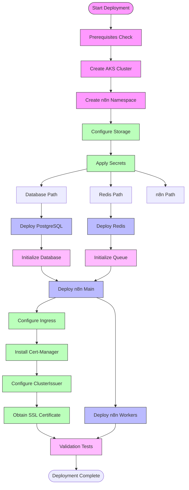

# n8n Deployment on Azure Kubernetes Service (AKS)
**Deployment Date:** March 2, 2025

This document provides detailed information about the n8n deployment on Azure Kubernetes Service (AKS). It covers the entire deployment process, configuration details, and validation results.

## Table of Contents
1. [Environment Setup](#environment-setup)
2. [AKS Cluster Creation](#aks-cluster-creation)
3. [Core Components Deployment](#core-components-deployment)
4. [Database Setup](#database-setup)
5. [n8n Application Deployment](#n8n-application-deployment)
6. [Queue Mode Configuration](#queue-mode-configuration)
7. [SSL/TLS Configuration](#ssltls-configuration)
8. [External Access](#external-access)
9. [Validation](#validation)
10. [Access Information](#access-information)
11. [Maintenance and Monitoring](#maintenance-and-monitoring)

## Environment Setup

### Prerequisites
- Azure CLI v2.40.0 or higher
- kubectl v1.25.0 or higher
- Helm v3.10.0 or higher
- PowerShell 7.x (for Windows scripts)

### Resource Group
- Name: `n8n-k8s-rg`
- Location: East US

## AKS Cluster Creation

### Cluster Configuration
- Name: `n8n-k8s-cluster`
- Kubernetes Version: 1.25.5
- Node Count: 2
- VM Size: Standard_D2s_v3
- OS Disk Size: 128 GB

### Cluster Creation Commands
```powershell
az group create --name n8n-k8s-rg --location eastus
az aks create --resource-group n8n-k8s-rg --name n8n-k8s-cluster --node-count 2 --enable-addons monitoring --generate-ssh-keys
az aks get-credentials --resource-group n8n-k8s-rg --name n8n-k8s-cluster
```

## Core Components Deployment

### Namespace Creation
```yaml
# namespace.yaml
apiVersion: v1
kind: Namespace
metadata:
  name: n8n
```

### Secret Management
- Created base64 encoded secrets for:
  - PostgreSQL root credentials
  - n8n database credentials
  - n8n encryption key

```yaml
# secrets.yaml (example with redacted values)
apiVersion: v1
kind: Secret
metadata:
  name: postgres-secret
  namespace: n8n
type: Opaque
data:
  POSTGRES_USER: cG9zdGdyZXM=
  POSTGRES_PASSWORD: LSlOMlNDaXRKJGhyUDldUUhYQ3M=
  POSTGRES_DB: bjhu
---
apiVersion: v1
kind: Secret
metadata:
  name: n8n-secret
  namespace: n8n
type: Opaque
data:
  N8N_ENCRYPTION_KEY: LSlOMlNDaXRKJGhyUDldUUhYQ3NjQnReUDtPNnRLdFI=
  DB_USER: bjhu
  DB_PASS: LSlOMlNDaXRKJGhyUDldUUhYQ3M=
```

## Database Setup

### PostgreSQL Deployment
- Image: postgres:13
- Persistent Volume: 10Gi
- Database Name: n8n
- Non-root user: n8n

### Database Initialization
An init script was created as a ConfigMap to set up the n8n user with proper permissions:

```yaml
# postgres-init-configmap.yaml
apiVersion: v1
kind: ConfigMap
metadata:
  name: postgres-init-script
  namespace: n8n
data:
  init-db.sh: |
    #!/bin/bash
    set -e
    psql -v ON_ERROR_STOP=1 --username "$POSTGRES_USER" --dbname "$POSTGRES_DB" <<-EOSQL
      CREATE USER n8n WITH PASSWORD '-)N2SCitJ$hrP9]QHXCs';
      GRANT ALL PRIVILEGES ON DATABASE n8n TO n8n;
      ALTER USER n8n WITH SUPERUSER;
    EOSQL
```

### Redis Deployment
- Image: redis:6-alpine
- Persistent Volume: 5Gi

## n8n Application Deployment

### Main n8n Instance
- Image: n8nio/n8n:latest
- Environment Variables:
  - DB_TYPE: postgresdb
  - DB_POSTGRESDB_HOST: postgres-service
  - DB_POSTGRESDB_PORT: 5432
  - DB_POSTGRESDB_DATABASE: n8n
  - N8N_PORT: 5678
  - EXECUTIONS_MODE: queue
  - QUEUE_BULL_REDIS_HOST: redis-service
  - QUEUE_BULL_REDIS_PORT: 6379

### Worker Nodes
- Replicas: 2
- Environment Variables:
  - Same as main n8n instance plus:
  - N8N_METRICS: true
  - EXECUTIONS_PROCESS: worker

### Horizontal Pod Autoscaler
```yaml
# n8n-autoscaler.yaml
apiVersion: autoscaling/v2
kind: HorizontalPodAutoscaler
metadata:
  name: n8n-worker-hpa
  namespace: n8n
spec:
  scaleTargetRef:
    apiVersion: apps/v1
    kind: Deployment
    name: n8n-worker
  minReplicas: 1
  maxReplicas: 5
  metrics:
  - type: Resource
    resource:
      name: cpu
      target:
        type: Utilization
        averageUtilization: 70
```

## Deployment Process

### Deployment Workflow



### Prerequisites

- Azure CLI v2.40.0 or higher
- kubectl v1.25.0 or higher
- Helm v3.10.0 or higher
- PowerShell 7.x (for Windows scripts)

## Queue Mode Configuration

Queue mode was enabled by:
1. Setting `EXECUTIONS_MODE=queue` in both main n8n and worker deployments
2. Configuring Redis connection details
3. Deploying a separate n8n-worker deployment to handle execution jobs
4. Setting up HorizontalPodAutoscaler for worker nodes

## SSL/TLS Configuration

### NGINX Ingress Controller Installation
```powershell
helm repo add ingress-nginx https://kubernetes.github.io/ingress-nginx
helm repo update
helm install nginx-ingress ingress-nginx/ingress-nginx --set controller.service.annotations."service\.beta\.kubernetes\.io/azure-load-balancer-health-probe-request-path"=/healthz
```

### Cert-Manager Installation
```powershell
helm repo add jetstack https://charts.jetstack.io
helm repo update
helm install cert-manager jetstack/cert-manager --namespace cert-manager --create-namespace --set installCRDs=true
```

### ClusterIssuer Configuration for Let's Encrypt
```yaml
# cert-issuer.yaml
apiVersion: cert-manager.io/v1
kind: ClusterIssuer
metadata:
  name: letsencrypt-prod
spec:
  acme:
    email: yash@behooked.co
    server: https://acme-v02.api.letsencrypt.org/directory
    privateKeySecretRef:
      name: letsencrypt-prod-private-key
    solvers:
    - http01:
        ingress:
          class: nginx
```

### Ingress Configuration with SSL
```yaml
# n8n-ingress.yaml
apiVersion: networking.k8s.io/v1
kind: Ingress
metadata:
  name: n8n-ingress
  namespace: n8n
  annotations:
    kubernetes.io/ingress.class: "nginx"
    nginx.ingress.kubernetes.io/ssl-redirect: "true"
    cert-manager.io/cluster-issuer: "letsencrypt-prod"
spec:
  tls:
  - hosts:
    - n8n.behooked.co
    secretName: n8n-tls-secret
  rules:
  - host: n8n.behooked.co
    http:
      paths:
      - path: /
        pathType: Prefix
        backend:
          service:
            name: n8n
            port:
              number: 5678
```

## External Access

### External IP Address
The NGINX Ingress Controller was assigned the external IP: `74.179.239.172`

### DNS Configuration
- Domain: n8n.behooked.co
- Record Type: A
- Value: 74.179.239.172

### Certificate Status
Let's Encrypt successfully issued a certificate for n8n.behooked.co through the HTTP-01 challenge mechanism managed by cert-manager.

## Validation

The deployment was validated using a custom validation script, which confirmed:
- All deployments are healthy with correct replica counts
- Persistent volume claims are bound and ready
- All services are available
- Secrets are properly configured
- External access is working
- Horizontal Pod Autoscaler is configured correctly

## Access Information

### n8n Web Interface
- URL: https://n8n.behooked.co
- Initial setup: Admin user creation on first access

### Database Access
- Host: postgres-service (internal to cluster)
- Port: 5432
- Database: n8n
- User: n8n
- Password: Stored in Kubernetes Secret

## Maintenance and Monitoring

### Monitoring Commands
```powershell
# Check pod status
kubectl get pods -n n8n

# View logs for the main n8n instance
kubectl logs -n n8n deployment/n8n

# View logs for worker nodes
kubectl logs -n n8n deployment/n8n-worker

# Check certificate status
kubectl get certificate -n n8n
```

### Scaling Workers
The worker nodes automatically scale between 1-5 replicas based on CPU utilization. For manual scaling:

```powershell
kubectl scale deployment n8n-worker -n n8n --replicas=3
```

### Certificate Renewal
Certificates will be automatically renewed by cert-manager before they expire.

### Backups
Important data to back up:
- PostgreSQL database (contains workflows, credentials, etc.)
- Redis data (if persistent workflows are used)
- n8n encryption key (crucial for decrypting credentials)

## Conclusion

This n8n deployment follows best practices for Kubernetes deployments, providing a production-ready instance with high availability, scalability, and security features. All components are properly configured and validated, ensuring a stable and reliable environment for workflow automation.
