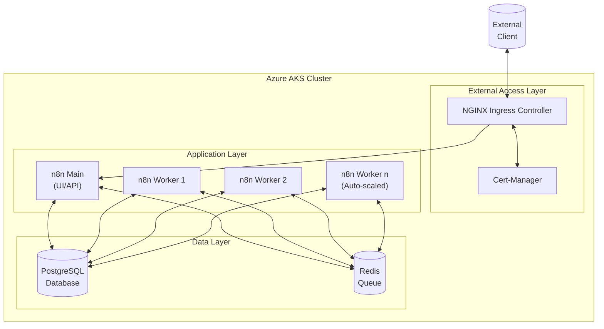

# n8n on Azure Kubernetes Service (AKS)

<div align="center">
  
  <br>
  <h3>Enterprise-Grade Workflow Automation on Azure Kubernetes Service</h3>
  
  [](https://opensource.org/licenses/MIT)
  [](https://kubernetes.io/)
  [](https://azure.microsoft.com/)
  [](https://n8n.io/)
</div>

## 📋 Table of Contents

- [Overview](#overview)
- [Architecture](#architecture)
- [Features](#features)
- [Prerequisites](#prerequisites)
- [Installation](#installation)
- [Configuration](#configuration)
- [Usage](#usage)
- [Advanced Topics](#advanced-topics)
- [Monitoring and Maintenance](#monitoring-and-maintenance)
- [Troubleshooting](#troubleshooting)
- [Contributing](#contributing)
- [License](#license)
- [Contact](#contact)

## 🔍 Overview

This repository provides a production-ready solution for deploying [n8n](https://n8n.io) on Azure Kubernetes Service (AKS). n8n is a workflow automation tool that allows you to connect different services and build automated workflows without coding. This deployment implements enterprise best practices including high availability, scaling, security, and monitoring.

## 🏗️ Architecture

The deployment follows a scalable, resilient architecture designed for production workloads:



**Key Components:**
- **n8n Main**: Serves the web UI and API
- **n8n Workers**: Execute workflows in distributed mode (auto-scaling)
- **PostgreSQL**: Stores workflow definitions and execution data
- **Redis**: Manages workflow execution queue
- **NGINX Ingress**: Handles external traffic and TLS termination
- **Cert-Manager**: Manages SSL/TLS certificates from Let's Encrypt

## ✨ Features

- **📈 Scalable Architecture**
  - Queue mode for distributed workflow execution
  - Worker nodes with horizontal pod autoscaling (1-5 nodes)
  - Handles high-volume workflow processing

- **🔒 Enterprise Security**
  - Automated SSL/TLS with Let's Encrypt
  - Secure secrets management
  - Database authentication
  - Encryption key management

- **💾 Data Persistence**
  - Reliable Azure managed disks for PostgreSQL and Redis
  - Automatic database backups (via provided utility)
  - Data resilience across pod restarts

- **🔄 High Availability**
  - Multi-node Kubernetes cluster
  - Self-healing deployments
  - Health checks and readiness probes

- **📊 Monitoring Ready**
  - Prometheus metrics support
  - Compatible with Azure Monitor
  - Comprehensive logging

## 📋 Prerequisites

Before you begin, ensure you have the following:

- Azure subscription
- [Azure CLI](https://docs.microsoft.com/en-us/cli/azure/install-azure-cli) installed and configured
- [kubectl](https://kubernetes.io/docs/tasks/tools/install-kubectl/) installed
- [Helm](https://helm.sh/docs/intro/install/) installed
- [PowerShell](https://docs.microsoft.com/en-us/powershell/scripting/install/installing-powershell) (for Windows) or Bash shell (for Linux/macOS)
- A registered domain name (for SSL/TLS)

## 🚀 Installation

### Option 1: Automated Deployment (PowerShell)

```powershell
# Clone the repository
git clone https://github.com/yourusername/n8n-azure-k8s.git
cd n8n-azure-k8s

# Run the deployment script
.\scripts\deploy-aks.ps1 -ResourceGroup "my-n8n-rg" -Location "eastus" -ClusterName "my-n8n-cluster"
```

### Option 2: Automated Deployment (Bash)

```bash
# Clone the repository
git clone https://github.com/yourusername/n8n-azure-k8s.git
cd n8n-azure-k8s

# Make scripts executable
chmod +x scripts/*.sh

# Run the deployment script
./scripts/deploy.sh --resource-group "my-n8n-rg" --location "eastus" --cluster-name "my-n8n-cluster"
```

### Option 3: Manual Deployment

For detailed step-by-step manual deployment instructions, please refer to the [DEPLOYMENT_DETAILS.md](DEPLOYMENT_DETAILS.md) document.

## ⚙️ Configuration

### Environment Variables

The n8n deployment can be customized through various environment variables in the `k8s/n8n-deployment.yaml` file. Key configurations include:

| Variable | Description | Default |
|----------|-------------|---------|
| `DB_TYPE` | Database type | `postgresdb` |
| `DB_POSTGRESDB_HOST` | PostgreSQL hostname | `postgres-service` |
| `DB_POSTGRESDB_PORT` | PostgreSQL port | `5432` |
| `DB_POSTGRESDB_DATABASE` | PostgreSQL database name | `n8n` |
| `EXECUTIONS_MODE` | Execution mode | `queue` |
| `QUEUE_BULL_REDIS_HOST` | Redis hostname | `redis-service` |
| `QUEUE_BULL_REDIS_PORT` | Redis port | `6379` |
| `WEBHOOK_TUNNEL_URL` | External webhook URL | `https://n8n.yourdomain.com` |

### Custom Domain Configuration

1. Get the external IP of your ingress controller:
   ```powershell
   kubectl get service nginx-ingress-ingress-nginx-controller
   ```

2. Create an A record in your DNS provider:
   - Type: A
   - Name: n8n (or your subdomain of choice)
   - Value: [External IP from step 1]

3. The SSL/TLS certificate will be automatically provisioned once DNS propagates.

## 🔧 Usage

### Accessing n8n

Once deployed, access n8n through your configured domain:

```
https://n8n.yourdomain.com
```

### Managing Your Deployment

Use the provided management script for common operations:

```powershell
# View status of all components
.\scripts\manage-n8n.ps1 -Command status

# View logs
.\scripts\manage-n8n.ps1 -Command logs -Component n8n

# Scale worker nodes
.\scripts\manage-n8n.ps1 -Command scale -Replicas 3

# Restart components
.\scripts\manage-n8n.ps1 -Command restart -Component postgres

# Check certificate status
.\scripts\manage-n8n.ps1 -Command certificate

# Create a database backup
.\scripts\manage-n8n.ps1 -Command backup
```

## 🧠 Advanced Topics

### Queue Mode Optimization

Queue mode separates workflow execution from the main n8n process for better performance. For optimal results:

- Adjust worker replica count based on workflow volume
- Consider memory requirements for complex workflows
- Configure proper CPU allocations in deployment YAML

For detailed queue mode information, see [n8n Queue Mode Documentation](https://docs.n8n.io/hosting/scaling/queue-mode/).

### Persistent Storage Management

The deployment uses Azure managed disks for data persistence. Consider these best practices:

- Regular database backups using the provided script
- Monitoring disk usage and performance
- Adjusting storage capacity as your workflow count increases

## 📊 Monitoring and Maintenance

### Health Checks

```powershell
# Check pod health
kubectl get pods -n n8n

# Detailed pod status
kubectl describe pod -n n8n <pod-name>
```

### Logs

```powershell
# View n8n logs
kubectl logs -n n8n deployment/n8n --tail=100

# View worker logs
kubectl logs -n n8n deployment/n8n-worker --tail=100
```

### Updating n8n

To update n8n to a newer version:

```powershell
# Edit the n8n-deployment.yaml and n8n-worker-deployment.yaml files
# Change image: n8nio/n8n:latest to your desired version

# Apply the changes
kubectl apply -f k8s/n8n-deployment.yaml
kubectl apply -f k8s/n8n-worker-deployment.yaml
```

## ❓ Troubleshooting

### Common Issues

| Issue | Solution |
|-------|----------|
| n8n pods in CrashLoopBackOff | Check logs: `kubectl logs -n n8n deploy/n8n`. Common causes are database connection issues or invalid environment variables. |
| Certificate not issuing | Verify DNS is correctly configured and propagated. Check cert-manager logs: `kubectl logs -n cert-manager deploy/cert-manager`. |
| Database connection issues | Ensure PostgreSQL pod is running and the user has correct permissions. Check initialization script in ConfigMap. |
| Workers not processing jobs | Verify Redis is running and properly configured. Check worker logs for queue connectivity issues. |

For detailed troubleshooting steps, refer to [TROUBLESHOOTING.md](docs/TROUBLESHOOTING.md).

## 👥 Contributing

Contributions are welcome! Please feel free to submit a Pull Request.

1. Fork the repository
2. Create your feature branch (`git checkout -b feature/amazing-feature`)
3. Commit your changes (`git commit -m 'Add some amazing feature'`)
4. Push to the branch (`git push origin feature/amazing-feature`)
5. Open a Pull Request

## 📄 License

This project is licensed under the MIT License - see the [LICENSE](LICENSE) file for details.

## 📞 Contact

For questions or support, please open an issue in the GitHub repository or contact the maintainers:

- Email: your-email@example.com
- GitHub: [@yourusername](https://github.com/yourusername)

---

<div align="center">
  <sub>Built with ❤️ for the n8n community</sub>
</div>