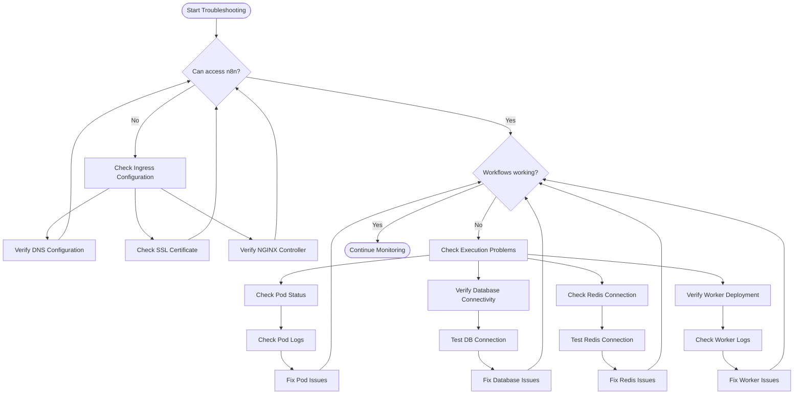

# n8n on AKS: Troubleshooting Guide

This guide provides solutions for common issues you might encounter with your n8n deployment on Azure Kubernetes Service.

## Troubleshooting Workflow



## Table of Contents

- [Connectivity Issues](#connectivity-issues)
- [Pod Status Issues](#pod-status-issues)
- [Database Issues](#database-issues)
- [Redis Issues](#redis-issues)
- [SSL/TLS Certificate Issues](#ssltls-certificate-issues)
- [Worker and Queue Mode Issues](#worker-and-queue-mode-issues)
- [Performance Problems](#performance-problems)
- [Upgrade Issues](#upgrade-issues)
- [Diagnostic Commands](#diagnostic-commands)

## Connectivity Issues

### Cannot Access n8n Web Interface

**Symptoms**: The n8n web interface is not accessible via the browser.

**Troubleshooting Steps**:

1. Check if the ingress is properly configured:
   ```powershell
   kubectl get ingress -n n8n
   ```

2. Verify the external IP is assigned:
   ```powershell
   kubectl get service nginx-ingress-ingress-nginx-controller
   ```

3. Test connectivity to the n8n service from within the cluster:
   ```powershell
   kubectl run curl --image=curlimages/curl -i --rm --tty -- curl -s http://n8n.n8n.svc.cluster.local:5678
   ```

4. Make sure DNS is properly configured with an A record pointing to the external IP.

5. Check the ingress controller logs:
   ```powershell
   kubectl logs -n default deployment/nginx-ingress-ingress-nginx-controller
   ```

**Solution**: Ensure the DNS record is correctly set up and propagated, and that the ingress controller is properly configured. If using HTTPS, make sure the certificate has been issued successfully.

### Webhook Issues

**Symptoms**: External services cannot call n8n webhooks.

**Troubleshooting Steps**:

1. Verify the `WEBHOOK_TUNNEL_URL` environment variable is set correctly in the n8n deployment:
   ```powershell
   kubectl get deployment n8n -n n8n -o jsonpath='{.spec.template.spec.containers[0].env[?(@.name=="WEBHOOK_TUNNEL_URL")].value}'
   ```

2. Check that the URL is accessible from the internet.

**Solution**: Update the `WEBHOOK_TUNNEL_URL` in the n8n deployment YAML file:
```powershell
kubectl edit deployment n8n -n n8n
```
Change the value to your actual domain, then save and exit.

## Pod Status Issues

### Pods in CrashLoopBackOff

**Symptoms**: n8n or worker pods show `CrashLoopBackOff` status.

**Troubleshooting Steps**:

1. Check the pod logs:
   ```powershell
   kubectl logs -n n8n <pod-name>
   ```

2. Look for specific error messages related to:
   - Database connection issues
   - Redis connection issues
   - Invalid environment variables
   - Insufficient resources

**Solution**: The specific solution depends on the error message. Common fixes include:
- Correcting database credentials
- Ensuring PostgreSQL service is running
- Checking Redis connectivity
- Adjusting resource limits

### Pods Stuck in Pending State

**Symptoms**: Pods remain in `Pending` status and don't start.

**Troubleshooting Steps**:

1. Describe the pod to see events:
   ```powershell
   kubectl describe pod -n n8n <pod-name>
   ```

2. Check if there are insufficient resources or node selector issues.

**Solution**: 
- If it's a resource issue, adjust CPU/memory requests or add nodes to your cluster
- If PersistentVolumeClaim is pending, check storage class availability

## Database Issues

### Database Connection Failures

**Symptoms**: n8n logs show PostgreSQL connection errors.

**Troubleshooting Steps**:

1. Verify the PostgreSQL pod is running:
   ```powershell
   kubectl get pods -n n8n -l app=postgres
   ```

2. Check PostgreSQL logs:
   ```powershell
   kubectl logs -n n8n deployment/postgres
   ```

3. Verify database connection parameters in n8n environment variables.

4. Test direct connection to PostgreSQL:
   ```powershell
   kubectl exec -it -n n8n deployment/postgres -- psql -U postgres -d n8n -c "SELECT 1;"
   ```

**Solution**:
- Ensure PostgreSQL pod is running
- Check if n8n user was created properly through the init script
- Verify credentials in the secrets match those used in the database
- Restart PostgreSQL if necessary

### Data Persistence Issues

**Symptoms**: Data is lost after pod restarts.

**Troubleshooting Steps**:

1. Check if PVC is correctly bound:
   ```powershell
   kubectl get pvc -n n8n
   ```

2. Verify that PostgreSQL is using the correct volume mount:
   ```powershell
   kubectl describe deployment postgres -n n8n
   ```

**Solution**: Ensure the PVC is correctly created and bound, and that PostgreSQL is configured to use it. If data has been lost, restore from a backup if available.

## Redis Issues

### Queue Connectivity Problems

**Symptoms**: Worker nodes can't connect to Redis.

**Troubleshooting Steps**:

1. Check if Redis pod is running:
   ```powershell
   kubectl get pods -n n8n -l app=redis
   ```

2. Verify Redis service is available:
   ```powershell
   kubectl get service redis-service -n n8n
   ```

3. Test Redis connectivity from a worker pod:
   ```powershell
   kubectl exec -it -n n8n <worker-pod-name> -- redis-cli -h redis-service ping
   ```

**Solution**:
- Ensure Redis pod is running
- Check Redis service configuration
- Verify Redis connection settings in n8n and worker deployments

## SSL/TLS Certificate Issues

### Certificate Not Issuing

**Symptoms**: The Let's Encrypt certificate remains in a "False" ready state.

**Troubleshooting Steps**:

1. Check certificate status:
   ```powershell
   kubectl get certificate -n n8n
   ```

2. Look at the detailed certificate information:
   ```powershell
   kubectl describe certificate -n n8n n8n-tls-secret
   ```

3. Check cert-manager logs:
   ```powershell
   kubectl logs -n cert-manager deployment/cert-manager
   ```

4. Verify that the ClusterIssuer is correctly configured:
   ```powershell
   kubectl get clusterissuer letsencrypt-prod -o yaml
   ```

**Solution**:
- Ensure DNS is properly configured and propagated
- Check that HTTP-01 challenge can reach your ingress (port 80 must be accessible)
- Verify your email address is correct in the ClusterIssuer
- If needed, recreate the certificate resource

## Worker and Queue Mode Issues

### Workflows Not Executing

**Symptoms**: Workflows are triggered but don't execute, or execution is delayed.

**Troubleshooting Steps**:

1. Check if worker pods are running:
   ```powershell
   kubectl get pods -n n8n -l app=n8n-worker
   ```

2. View worker logs:
   ```powershell
   kubectl logs -n n8n deployment/n8n-worker
   ```

3. Verify queue mode settings:
   ```powershell
   kubectl get deployment n8n -n n8n -o jsonpath='{.spec.template.spec.containers[0].env[?(@.name=="EXECUTIONS_MODE")].value}'
   ```

4. Check Redis connectivity (see Redis Issues section).

**Solution**:
- Ensure worker pods are running
- Verify queue mode is properly configured
- Check Redis connectivity
- Restart workers if necessary

### Worker Scaling Issues

**Symptoms**: Workers don't scale up under load.

**Troubleshooting Steps**:

1. Check HPA configuration:
   ```powershell
   kubectl get hpa -n n8n
   ```

2. View detailed HPA status:
   ```powershell
   kubectl describe hpa -n n8n n8n-worker-hpa
   ```

3. Verify metrics are being collected.

**Solution**:
- Ensure metrics-server is running in the cluster
- Check that CPU/memory thresholds are appropriately set
- Manually scale workers if needed

## Performance Problems

### Slow Workflow Execution

**Symptoms**: Workflows take longer than expected to execute.

**Troubleshooting Steps**:

1. Check CPU and memory usage:
   ```powershell
   kubectl top pods -n n8n
   ```

2. View worker resource limits:
   ```powershell
   kubectl get deployment n8n-worker -n n8n -o jsonpath='{.spec.template.spec.containers[0].resources}'
   ```

3. Check if there's a backlog of jobs in Redis:
   ```powershell
   kubectl exec -it -n n8n deployment/redis -- redis-cli -h localhost LLEN bull:n8n-main:wait
   ```

**Solution**:
- Increase worker resources (CPU/memory)
- Scale up the number of worker replicas
- Consider optimizing complex workflows
- For high-throughput scenarios, adjust Bull queue concurrency settings

## Upgrade Issues

### Problems After Upgrading n8n

**Symptoms**: After upgrading n8n image version, workflows fail or UI has issues.

**Troubleshooting Steps**:

1. Check n8n logs for errors:
   ```powershell
   kubectl logs -n n8n deployment/n8n
   ```

2. Verify database migrations completed:
   Look for migration-related logs in the output.

3. Check if the database schema is compatible with the new version.

**Solution**:
- If database schema changes are incompatible, restore from backup and plan a proper migration
- Roll back to previous version if needed:
  ```powershell
  kubectl set image deployment/n8n n8n=n8nio/n8n:previous-version -n n8n
  kubectl set image deployment/n8n-worker n8n-worker=n8nio/n8n:previous-version -n n8n
  ```

## Diagnostic Commands

Here are some useful commands for diagnosing issues with your n8n deployment:

### Overall Status
```powershell
# Run the validation script
.\scripts\manage-n8n.ps1 -Command status

# Get events in the n8n namespace
kubectl get events -n n8n
```

### Networking Diagnostics
```powershell
# Test service connectivity
kubectl run network-test --image=busybox -i --rm --tty -- wget -O- http://n8n.n8n.svc.cluster.local:5678

# Check ingress controller status
kubectl describe pods -n default -l app.kubernetes.io/name=ingress-nginx
```

### Data Persistence Checks
```powershell
# Check PV and PVC status
kubectl get pv,pvc -n n8n

# Check storage classes
kubectl get storageclass
```

### Configuration Validation
```powershell
# Check environment variables
kubectl exec -it -n n8n deployment/n8n -- env | grep -E 'DB_|QUEUE_|EXECUTIONS_'

# Verify secrets are properly mounted
kubectl exec -it -n n8n deployment/n8n -- ls -la /var/run/secrets/kubernetes.io/serviceaccount/
```

## Getting Additional Help

If you're unable to resolve an issue after following this troubleshooting guide, consider:

1. Checking the [n8n documentation](https://docs.n8n.io/)
2. Posting on the [n8n community forum](https://community.n8n.io/)
3. Opening an issue in the GitHub repository
4. Consulting Azure Kubernetes Service documentation for AKS-specific issues
