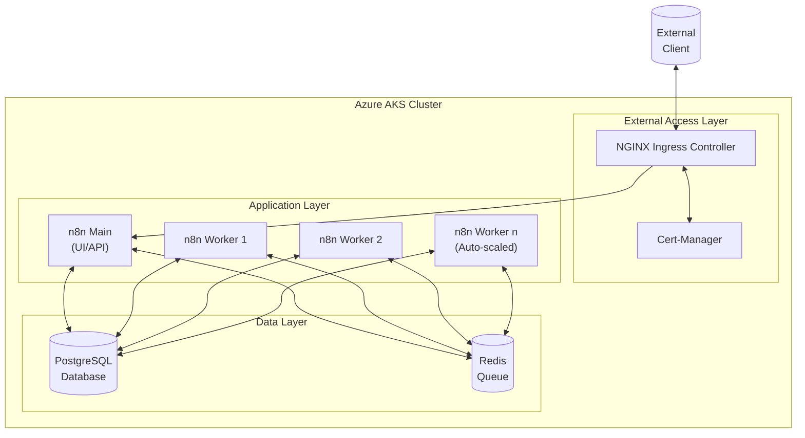

*This is Part 1 of the "Building a Production-Ready n8n Workflow Automation Platform on Azure Kubernetes Service" series. [View the complete series here](#series-link).*

# Building a Production-Ready n8n Workflow Automation Platform on Azure Kubernetes Service

## Introduction

In today's fast-paced digital landscape, workflow automation has become essential for businesses to operate efficiently. As organizations grow, the need for robust, scalable automation solutions becomes increasingly crucial. This blog post details our journey of implementing a production-grade [n8n](https://n8n.io/) workflow automation platform on Azure Kubernetes Service (AKS).

### What is n8n?

n8n (pronounced "n-eight-n") is an open-source workflow automation tool that allows you to connect different services and build automated workflows without writing code. It's like Zapier or Integromat, but with the advantage of being self-hosted, giving you complete control over your data and workflows.

Some key features of n8n include:
- Visual workflow editor
- 200+ built-in integrations
- Webhooks for real-time triggers
- Custom JavaScript functions
- Self-hosting capability
- API access

### Why Kubernetes for n8n?

While n8n can run on a simple VM or even locally, a production deployment demands more:

- **High Availability**: Ensure your automation workflows run 24/7
- **Scalability**: Handle growing workflow volume as your needs increase
- **Resource Efficiency**: Optimize resource allocation based on actual demand
- **Disaster Recovery**: Protect against data loss and service interruptions
- **Simplified Management**: Standardize deployment, updates, and monitoring

Kubernetes addresses these requirements by providing a container orchestration platform that can manage complex applications with multiple components.

### Why Azure Kubernetes Service?

Azure Kubernetes Service (AKS) offers several advantages for hosting n8n:

- **Managed Control Plane**: Focus on your application rather than managing Kubernetes infrastructure
- **Integrated Security**: Azure Active Directory integration, network security policies, and RBAC
- **Simple Scaling**: Easy horizontal and vertical scaling of nodes
- **Azure Integration**: Seamless integration with other Azure services like Storage, Monitoring, and Networking
- **Cost Optimization**: Pay only for the worker nodes, as the control plane is free

### First Principles Approach

In this article, we'll take a first principles approach, understanding the fundamental requirements of a production workflow system before implementing our solution. This means:

1. Starting with the core needs (data persistence, execution reliability, security)
2. Breaking down the system into logical components
3. Understanding the interactions between components
4. Building up a robust architecture that meets all requirements
5. Implementing with best practices for production environments

Let's dive into the architecture from first principles.

## Understanding the Architecture (First Principles)

When designing a production workflow system, we need to consider several fundamental requirements:

### 1. Data Persistence

Workflows and their execution data must be stored reliably. This requires:
- A database for storing workflow definitions and execution records
- Persistent storage that survives container restarts
- Backup capabilities for disaster recovery

### 2. Execution Reliability

Workflow executions must be reliable, even under high load:
- Queue-based processing to handle spikes in workflow triggers
- Worker redundancy to prevent single points of failure
- Graceful handling of errors and retries

### 3. Security

Sensitive data and external access must be secured:
- Encryption for data at rest and in transit
- Secure storage of credentials and API keys
- Authentication and authorization controls
- Network security for external access

### 4. Scalability

The system must scale as workflow needs grow:
- Horizontal scaling for workers under load
- Database performance optimization
- Resource allocation efficiency

### 5. Maintainability

The deployment must be easy to maintain over time:
- Monitoring and logging
- Simple update processes
- Documentation for operational procedures

With these first principles in mind, we can design our n8n deployment architecture.

## Architecture Overview

Our n8n on AKS architecture consists of the following components:

### Layer Breakdown

#### 1. Data Layer

- **PostgreSQL**: Stores workflow definitions, credentials, and execution records
  - Uses persistent volume for data durability
  - Configured with appropriate resources for performance
  - Non-root user for n8n database access

- **Redis**: Manages workflow execution queue
  - Enables distributed execution across workers
  - Tracks execution state and enables retries
  - Provides inter-process communication

#### 2. Application Layer

- **n8n Main**: Serves the web UI and API
  - Handles workflow editing and management
  - Processes webhook triggers
  - Enqueues workflows for execution

- **n8n Workers**: Execute workflow tasks
  - Horizontally scalable based on load
  - Pull jobs from Redis queue
  - Report execution results back to the database

#### 3. External Access Layer

- **NGINX Ingress Controller**: Routes external traffic
  - Terminates SSL/TLS
  - Handles HTTP routing rules
  - Load balances incoming requests

- **Cert-Manager**: Manages SSL/TLS certificates
  - Automates certificate issuance from Let's Encrypt
  - Handles certificate renewal
  - Configures HTTPS security

### Data Flow

1. External clients connect to the n8n UI/API via the ingress controller
2. The n8n main service handles UI interactions and API requests
3. When a workflow is triggered, it's added to the Redis queue
4. Worker nodes pick up workflow executions from the queue
5. Workers execute the workflow and store results in PostgreSQL
6. The n8n main service displays execution results to users

This architecture provides:
- Clear separation of concerns
- Scalability at each layer
- High availability through redundancy
- Security through proper isolation

In the next sections, we'll dive into the implementation details of each component, starting with the AKS cluster setup.

## Conclusion

In this architecture overview, we've laid out the foundation for a robust n8n deployment on Azure Kubernetes Service. This architecture addresses the core requirements for a production deployment: high availability, scalability, security, and maintainability.

By separating our architecture into distinct layers—data, application, and external access—we've created a modular design that's easier to maintain and troubleshoot. Each component has a specific responsibility, with clear interfaces between them.

In this first article, we've established the foundational principles and architecture for our n8n deployment on AKS. We've explored why n8n is a powerful choice for workflow automation and how Kubernetes provides the ideal platform for a scalable, reliable implementation.

In the next article, we'll turn this architecture into reality by setting up our Azure Kubernetes Service cluster, configuring networking, and preparing the persistent storage foundation. [Continue to Part 2: Setting Up the Foundation](#part2-link)

## Series Navigation

- [Part 1: Introduction & Architecture](#part1-link)
- [Part 2: Setting Up the Foundation](#part2-link)
- [Part 3: Data Layer Implementation](#part3-link)
- [Part 4: Application Layer](#part4-link)
- [Part 5: External Access and Security](#part5-link)
- [Part 6: Monitoring and Optimization](#part6-link)
- [Part 7: Troubleshooting Guide](#part7-link)
- [Part 8: Conclusion and Next Steps](#part8-link)

---

Have you deployed n8n or similar workflow tools in Kubernetes? Share your experience in the comments!

Check out the complete code for this project on [GitHub](https://github.com/devs-hooked/n8n-azure-k8s) and feel free to star the repository if it's useful to you.

*This is the end of Part 1. Continue to [Part 2: Setting Up the Foundation](#part2-link) to learn how to set up your Azure Kubernetes Service cluster and prepare the foundation for your n8n deployment.*
