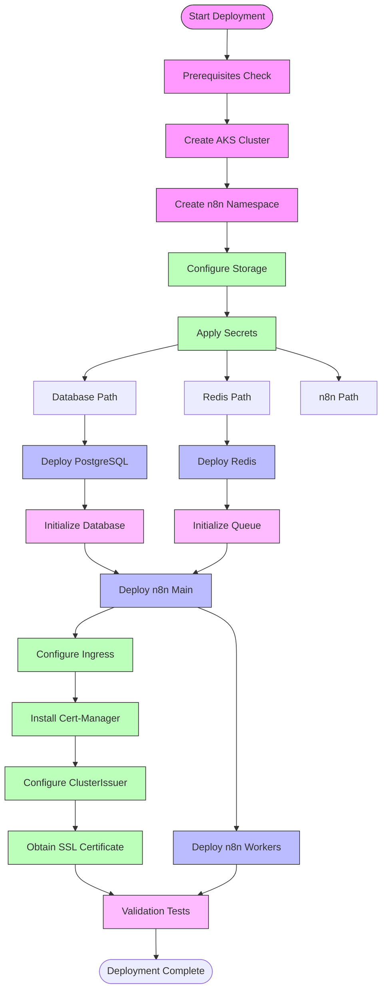

*This is Part 2 of the "Building a Production-Ready n8n Workflow Automation Platform on Azure Kubernetes Service" series. [View the complete series here](#series-link).*

# Setting Up the Foundation

## Creating the AKS Cluster

The first step in our implementation is setting up the Azure Kubernetes Service (AKS) cluster. This forms the foundation of our entire deployment.

### Resource Planning

Before creating the cluster, we determined our resource requirements:

- **Node Count**: 2 nodes for basic high availability
- **VM Size**: D2s v3 (2 vCPUs, 8GB RAM) for good performance
- **Region**: East US (chosen for proximity to our users)
- **Kubernetes Version**: 1.25.5 (stable version with good feature support)

### Creating the Cluster with Azure CLI

We used Azure CLI for cluster creation to make the process reproducible:

```bash
# Create resource group
az group create --name n8n-aks-rg --location eastus

# Create AKS cluster
az aks create \
  --resource-group n8n-aks-rg \
  --name n8n-cluster \
  --node-count 2 \
  --node-vm-size Standard_D2s_v3 \
  --kubernetes-version 1.25.5 \
  --enable-managed-identity \
  --generate-ssh-keys
```

This command creates a basic AKS cluster with managed identity for simplified authentication. The SSH keys are automatically generated for node access if needed.

### Connecting to the Cluster

After cluster creation, we configured `kubectl` to connect to our new cluster:

```bash
# Get credentials
az aks get-credentials --resource-group n8n-aks-rg --name n8n-cluster

# Verify connection
kubectl get nodes
```

The output confirmed our two nodes were running:

```
NAME                                STATUS   ROLES   AGE   VERSION
aks-nodepool1-12345678-vmss000000   Ready    agent   3m    v1.25.5
aks-nodepool1-12345678-vmss000001   Ready    agent   3m    v1.25.5
```

## Namespace Organization

We created a dedicated namespace for our n8n deployment to isolate it from other applications that might run on the same cluster:

```bash
# Create namespace
kubectl create namespace n8n

# Set as default namespace for this context
kubectl config set-context --current --namespace=n8n
```

Using a dedicated namespace provides several benefits:
- Resource isolation
- Simplified RBAC (Role-Based Access Control)
- Clear resource organization
- Ability to set resource quotas per namespace

## Network Architecture

### Network Considerations

In our design, we addressed several network requirements:

1. **External Access**: The n8n UI must be accessible externally via HTTPS
2. **Inter-Service Communication**: Components need to communicate within the cluster
3. **Security**: Network policies to restrict unnecessary communication

### Implementing the Ingress Controller

For external access, we installed the NGINX Ingress Controller:

```bash
# Add the Helm repository
helm repo add ingress-nginx https://kubernetes.github.io/ingress-nginx
helm repo update

# Install NGINX Ingress Controller
helm install nginx-ingress ingress-nginx/ingress-nginx \
  --namespace default \
  --set controller.replicaCount=2 \
  --set controller.nodeSelector."kubernetes\.io/os"=linux \
  --set defaultBackend.nodeSelector."kubernetes\.io/os"=linux
```

After installation, we verified the ingress controller's external IP:

```bash
kubectl get service nginx-ingress-ingress-nginx-controller
```

This returned our external IP (74.179.239.172) which we later used to configure DNS.

## Storage Classes and Persistent Volumes

### Storage Architecture

For our n8n deployment, we needed persistent storage for:
- PostgreSQL database
- Redis data (if needed for persistence)

AKS provides default storage classes that use Azure Disk or Azure File. We used the default storage class (`managed-premium`) which creates Azure Premium Managed Disks.

### Verifying Storage Classes

We checked available storage classes with:

```bash
kubectl get storageclass
```

The output confirmed the default storage class:

```
NAME                   PROVISIONER          RECLAIMPOLICY   VOLUMEBINDINGMODE   ALLOWVOLUMEEXPANSION   AGE
managed-premium (default)   disk.csi.azure.com   Delete          Immediate           true                   10m
managed-csi               disk.csi.azure.com   Delete          Immediate           true                   10m
```

### Creating Persistent Volume Claims

For PostgreSQL, we created a Persistent Volume Claim (PVC) to ensure data persistence:

```yaml
apiVersion: v1
kind: PersistentVolumeClaim
metadata:
  name: postgres-data-claim
  namespace: n8n
spec:
  accessModes:
    - ReadWriteOnce
  resources:
    requests:
      storage: 64Gi
  storageClassName: managed-premium
```

We saved this as `postgres-pvc.yaml` and applied it:

```bash
kubectl apply -f postgres-pvc.yaml
```

This PVC would be used by the PostgreSQL StatefulSet to store database files.

## Deployment Process

The overall deployment process follows this sequence:



This workflow ensures that dependencies are deployed in the correct order, with each component building upon the previous ones. In the next section, we'll set up the foundational data layer with PostgreSQL and Redis.

## Conclusion

With our AKS cluster provisioned and configured, we now have a solid foundation for our n8n deployment. We've set up proper namespaces, configured networking, and prepared our persistent storage requirements.

In the next article, we'll implement the data layer by deploying PostgreSQL and Redis with proper security configurations and persistence. [Continue to Part 3: Data Layer Implementation](#part3-link)

## Series Navigation

- [Part 1: Introduction & Architecture](#part1-link)
- [Part 2: Setting Up the Foundation](#part2-link)
- [Part 3: Data Layer Implementation](#part3-link)
- [Part 4: Application Layer](#part4-link)
- [Part 5: External Access and Security](#part5-link)
- [Part 6: Monitoring and Optimization](#part6-link)
- [Part 7: Troubleshooting Guide](#part7-link)
- [Part 8: Conclusion and Next Steps](#part8-link)

---

What challenges have you faced when setting up Kubernetes clusters for stateful applications? Share your experiences in the comments!

Check out the complete code for this project on [GitHub](https://github.com/devs-hooked/n8n-azure-k8s) and feel free to star the repository if it's useful to you.
