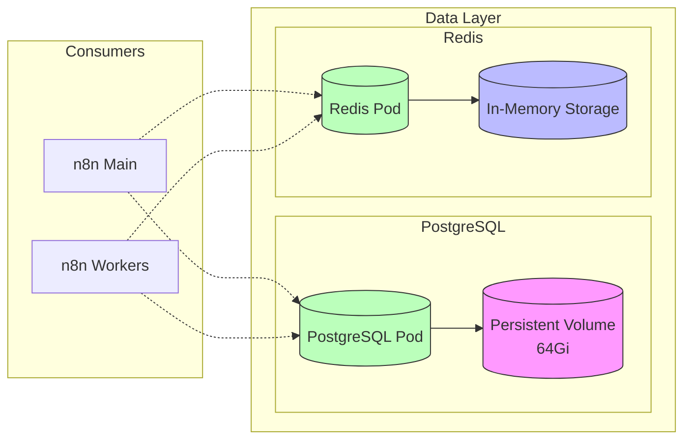

*This is Part 3 of the "Building a Production-Ready n8n Workflow Automation Platform on Azure Kubernetes Service" series. [View the complete series here](#series-link).*

# Implementing the Data Layer

A robust data layer is critical for any production workflow system. In our n8n deployment, the data layer consists of two primary components:

1. **PostgreSQL**: For persistent storage of workflows, credentials, and execution history
2. **Redis**: For queue management and workflow distribution

Let's implement each of these components with production-grade configurations.

## PostgreSQL Deployment

### Why PostgreSQL for n8n?

n8n stores various types of data that require a reliable, ACID-compliant database:

- Workflow definitions
- Execution history
- Credentials (encrypted)
- User accounts and settings
- Tags and other metadata

PostgreSQL is an excellent choice for n8n because it offers:
- Strong data integrity guarantees
- Rich feature set for complex queries
- Excellent performance for n8n's access patterns
- Mature ecosystem with extensive tooling
- Open-source with enterprise reliability

### Security Best Practices for PostgreSQL

For our production deployment, we implemented several security best practices:

1. **Dedicated Non-Root User**: Created a specific database user for n8n access
2. **Password Security**: Stored database credentials in Kubernetes Secrets
3. **Network Isolation**: Restricting access to within the Kubernetes cluster only
4. **Resource Limits**: Setting appropriate CPU and memory limits

### PostgreSQL Kubernetes Secrets

First, we created a Kubernetes Secret to store database credentials:

```yaml
apiVersion: v1
kind: Secret
metadata:
  name: postgres-secret
  namespace: n8n
type: Opaque
data:
  POSTGRES_USER: cG9zdGdyZXM=  # "postgres" base64 encoded
  POSTGRES_PASSWORD: cFstNUpxdHM9UyVGYzMrTEY=  # base64 encoded password
  POSTGRES_DB: bjhu  # "n8n" base64 encoded
```

> Note: For security, always generate strong random passwords for production deployments.

We applied this secret:

```bash
kubectl apply -f postgres-secret.yaml
```

### Database Initialization ConfigMap

To create a dedicated n8n user in PostgreSQL, we created a ConfigMap with an initialization script:

```yaml
apiVersion: v1
kind: ConfigMap
metadata:
  name: postgres-init-script
  namespace: n8n
data:
  init-db.sh: |
    #!/bin/bash
    set -e
    
    psql -v ON_ERROR_STOP=1 --username "$POSTGRES_USER" --dbname "$POSTGRES_DB" <<-EOSQL
      CREATE USER n8n WITH PASSWORD 'secure-password-here';
      GRANT ALL PRIVILEGES ON DATABASE n8n TO n8n;
      ALTER USER n8n WITH SUPERUSER;
    EOSQL
```

This script is executed when PostgreSQL starts, creating an n8n user with appropriate privileges.

### PostgreSQL Deployment Configuration

Now we can create the PostgreSQL deployment:

```yaml
apiVersion: apps/v1
kind: Deployment
metadata:
  name: postgres
  namespace: n8n
spec:
  replicas: 1
  selector:
    matchLabels:
      app: postgres
  template:
    metadata:
      labels:
        app: postgres
    spec:
      containers:
      - name: postgres
        image: postgres:13
        ports:
        - containerPort: 5432
        env:
        - name: POSTGRES_USER
          valueFrom:
            secretKeyRef:
              name: postgres-secret
              key: POSTGRES_USER
        - name: POSTGRES_PASSWORD
          valueFrom:
            secretKeyRef:
              name: postgres-secret
              key: POSTGRES_PASSWORD
        - name: POSTGRES_DB
          valueFrom:
            secretKeyRef:
              name: postgres-secret
              key: POSTGRES_DB
        volumeMounts:
        - name: postgres-data
          mountPath: /var/lib/postgresql/data
        - name: init-script
          mountPath: /docker-entrypoint-initdb.d
        resources:
          requests:
            memory: "512Mi"
            cpu: "500m"
          limits:
            memory: "1Gi"
            cpu: "1000m"
      volumes:
      - name: postgres-data
        persistentVolumeClaim:
          claimName: postgres-data-claim
      - name: init-script
        configMap:
          name: postgres-init-script
```

Key aspects of this configuration:
- Uses the PostgreSQL 13 image
- Mounts the persistent volume claim for data storage
- Mounts the initialization script ConfigMap
- Sets resource limits to ensure stability
- Uses environment variables from Kubernetes Secrets

### PostgreSQL Service

To make PostgreSQL accessible to other pods in the cluster, we created a Kubernetes Service:

```yaml
apiVersion: v1
kind: Service
metadata:
  name: postgres-service
  namespace: n8n
spec:
  selector:
    app: postgres
  ports:
  - port: 5432
    targetPort: 5432
  type: ClusterIP
```

This service provides a stable endpoint (`postgres-service`) for other components to connect to PostgreSQL.

## Redis Deployment

### Redis for Queue Management

Redis serves as the queue manager for n8n's distributed workflow execution. It:
- Maintains lists of pending workflows
- Tracks workflow execution state
- Enables worker coordination
- Provides fast in-memory operations

### Redis Deployment Configuration

We deployed Redis with the following configuration:

```yaml
apiVersion: apps/v1
kind: Deployment
metadata:
  name: redis
  namespace: n8n
spec:
  replicas: 1
  selector:
    matchLabels:
      app: redis
  template:
    metadata:
      labels:
        app: redis
    spec:
      containers:
      - name: redis
        image: redis:6-alpine
        ports:
        - containerPort: 6379
        resources:
          requests:
            memory: "256Mi"
            cpu: "200m"
          limits:
            memory: "512Mi"
            cpu: "500m"
        volumeMounts:
        - name: redis-data
          mountPath: /data
      volumes:
      - name: redis-data
        emptyDir: {}
```

For our use case, we chose a simple Redis deployment without persistence, as the queue data can be regenerated if lost. For more critical deployments, you could add a PersistentVolumeClaim similar to PostgreSQL.

### Redis Service

We created a Redis service to make it accessible to n8n components:

```yaml
apiVersion: v1
kind: Service
metadata:
  name: redis-service
  namespace: n8n
spec:
  selector:
    app: redis
  ports:
  - port: 6379
    targetPort: 6379
  type: ClusterIP
```

## Data Layer Architecture Diagram

Our complete data layer architecture can be visualized as:



This architecture provides:
- Clear separation between stateful services
- Persistent storage for critical data
- In-memory performance for queue operations
- Accessible services for n8n components

## Validation

After deploying PostgreSQL and Redis, we verified their status:

```bash
kubectl get pods -n n8n
```

Successful output looks like:

```
NAME                       READY   STATUS    RESTARTS   AGE
postgres-xxxxxxxxx-xxxxx   1/1     Running   0          2m
redis-xxxxxxxxx-xxxxx      1/1     Running   0          1m
```

We also verified the services:

```bash
kubectl get services -n n8n
```

With output:

```
NAME              TYPE        CLUSTER-IP       EXTERNAL-IP   PORT(S)    AGE
postgres-service  ClusterIP   10.0.xxx.xxx     <none>        5432/TCP   2m
redis-service     ClusterIP   10.0.xxx.xxx     <none>        6379/TCP   1m
```

Now that our data layer is properly set up, we can proceed to deploying the n8n application layer in the next section.

## Conclusion

With our data layer successfully deployed, we have reliable PostgreSQL storage for our workflow definitions and execution history, plus Redis for efficient queue management. These components form the persistence backbone of our n8n deployment.

In the next article, we'll deploy the n8n application itself, including the main service and worker nodes for distributed processing. [Continue to Part 4: Application Layer](#part4-link)

## Series Navigation

- [Part 1: Introduction & Architecture](#part1-link)
- [Part 2: Setting Up the Foundation](#part2-link)
- [Part 3: Data Layer Implementation](#part3-link)
- [Part 4: Application Layer](#part4-link)
- [Part 5: External Access and Security](#part5-link)
- [Part 6: Monitoring and Optimization](#part6-link)
- [Part 7: Troubleshooting Guide](#part7-link)
- [Part 8: Conclusion and Next Steps](#part8-link)

---

Have you implemented PostgreSQL or Redis in Kubernetes before? What database optimization techniques have worked best for your workflow automation systems? Share your insights in the comments!

Check out the complete code for this project on [GitHub](https://github.com/devs-hooked/n8n-azure-k8s) and feel free to star the repository if it's useful to you.
