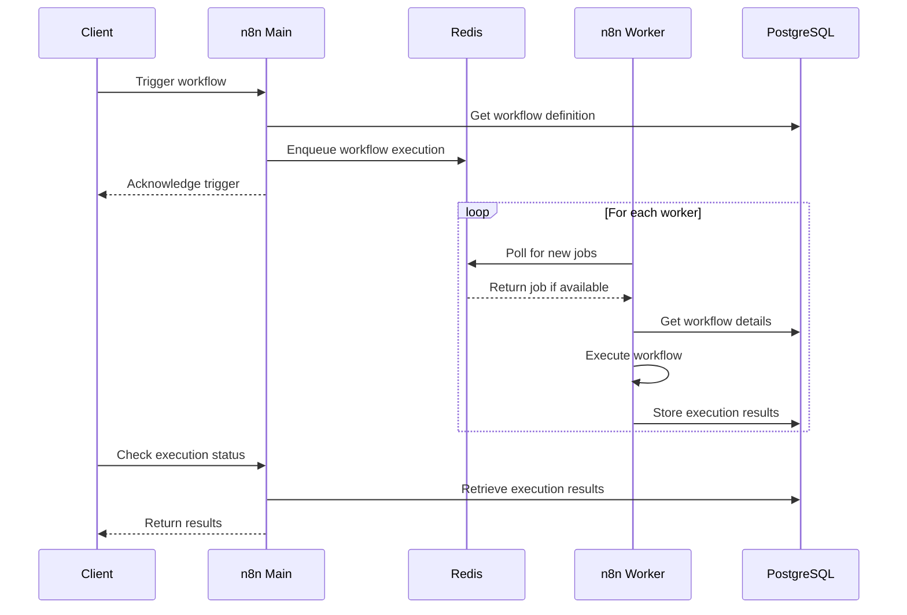
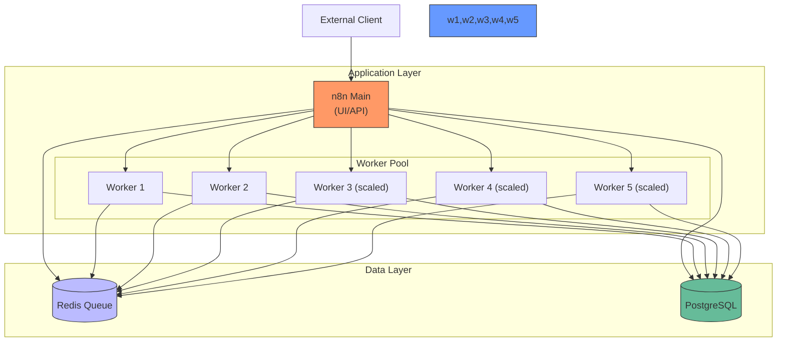

*This is Part 4 of the "Building a Production-Ready n8n Workflow Automation Platform on Azure Kubernetes Service" series. [View the complete series here](#series-link).*

# Implementing the Application Layer

With our data layer in place, we can now implement the application layer of our n8n deployment. This consists of two main components:

1. **n8n Main**: The primary n8n instance that serves the UI and API
2. **n8n Workers**: Dedicated execution nodes that process workflows

Let's configure these components for a production-ready deployment.

## n8n Configuration and Environment Variables

Before deploying n8n, we need to understand the key configuration options available.

### Key Environment Variables

n8n can be configured through numerous environment variables. The most important ones for our deployment are:

| Variable | Description | Value for Our Setup |
|----------|-------------|---------------------|
| `DB_TYPE` | Database type | `postgresdb` |
| `DB_POSTGRESDB_HOST` | PostgreSQL hostname | `postgres-service` |
| `DB_POSTGRESDB_PORT` | PostgreSQL port | `5432` |
| `DB_POSTGRESDB_DATABASE` | Database name | `n8n` |
| `DB_POSTGRESDB_USER` | Database user | `n8n` |
| `DB_POSTGRESDB_PASSWORD` | Database password | `[secured]` |
| `EXECUTIONS_MODE` | Execution mode | `queue` |
| `QUEUE_BULL_REDIS_HOST` | Redis hostname | `redis-service` |
| `QUEUE_BULL_REDIS_PORT` | Redis port | `6379` |
| `N8N_ENCRYPTION_KEY` | Encryption key for credentials | `[secured]` |
| `WEBHOOK_TUNNEL_URL` | External webhook URL | `https://n8n.yourdomain.com` |

### n8n Secrets

We created Kubernetes secrets to store sensitive values:

```yaml
apiVersion: v1
kind: Secret
metadata:
  name: n8n-secret
  namespace: n8n
type: Opaque
data:
  N8N_ENCRYPTION_KEY: YVZ2UnlSeXdWN1VjWjAzcWdzQWJQUWY0U1ZCV1Y0bWg=  # base64 encoded random string
  WEBHOOK_TUNNEL_URL: aHR0cHM6Ly9uOG4uYmVob29rZWQuY28=  # base64 encoded URL
  DB_POSTGRESDB_USER: bjhu  # base64 encoded "n8n"
  DB_POSTGRESDB_PASSWORD: c2VjdXJlLXBhc3N3b3JkLWhlcmU=  # base64 encoded password
```

> Note: Always generate a strong random string for the encryption key, as it's used to encrypt credentials stored in the database.

## Main n8n Deployment

The main n8n deployment serves the web UI and API, handling user requests and enqueueing workflows for execution.

```yaml
apiVersion: apps/v1
kind: Deployment
metadata:
  name: n8n
  namespace: n8n
spec:
  replicas: 1
  selector:
    matchLabels:
      app: n8n
  template:
    metadata:
      labels:
        app: n8n
    spec:
      containers:
      - name: n8n
        image: n8nio/n8n:latest
        ports:
        - containerPort: 5678
        env:
        - name: DB_TYPE
          value: "postgresdb"
        - name: DB_POSTGRESDB_HOST
          value: "postgres-service"
        - name: DB_POSTGRESDB_PORT
          value: "5432"
        - name: DB_POSTGRESDB_DATABASE
          value: "n8n"
        - name: DB_POSTGRESDB_USER
          valueFrom:
            secretKeyRef:
              name: n8n-secret
              key: DB_POSTGRESDB_USER
        - name: DB_POSTGRESDB_PASSWORD
          valueFrom:
            secretKeyRef:
              name: n8n-secret
              key: DB_POSTGRESDB_PASSWORD
        - name: N8N_ENCRYPTION_KEY
          valueFrom:
            secretKeyRef:
              name: n8n-secret
              key: N8N_ENCRYPTION_KEY
        - name: WEBHOOK_TUNNEL_URL
          valueFrom:
            secretKeyRef:
              name: n8n-secret
              key: WEBHOOK_TUNNEL_URL
        - name: EXECUTIONS_MODE
          value: "queue"
        - name: QUEUE_BULL_REDIS_HOST
          value: "redis-service"
        - name: QUEUE_BULL_REDIS_PORT
          value: "6379"
        resources:
          requests:
            memory: "512Mi"
            cpu: "300m"
          limits:
            memory: "1Gi"
            cpu: "600m"
        livenessProbe:
          httpGet:
            path: /healthz
            port: 5678
          initialDelaySeconds: 30
          periodSeconds: 10
        readinessProbe:
          httpGet:
            path: /healthz
            port: 5678
          initialDelaySeconds: 20
          periodSeconds: 5
```

Key aspects of this configuration:
- Uses the official n8n Docker image
- Configures database and Redis connection details
- Sets the execution mode to `queue`
- Configures resource limits
- Adds health checks for container reliability

### n8n Service

We exposed the n8n deployment through a Kubernetes service:

```yaml
apiVersion: v1
kind: Service
metadata:
  name: n8n
  namespace: n8n
spec:
  selector:
    app: n8n
  ports:
  - port: 5678
    targetPort: 5678
  type: ClusterIP
```

This service allows the Ingress controller to route traffic to n8n.

## n8n Worker Deployment

One of the key advantages of our architecture is the separation of the n8n UI/API from the workflow execution. This is achieved through dedicated worker nodes.

```yaml
apiVersion: apps/v1
kind: Deployment
metadata:
  name: n8n-worker
  namespace: n8n
spec:
  replicas: 2
  selector:
    matchLabels:
      app: n8n-worker
  template:
    metadata:
      labels:
        app: n8n-worker
    spec:
      containers:
      - name: n8n-worker
        image: n8nio/n8n:latest
        command: ["n8n", "worker"]
        env:
        - name: DB_TYPE
          value: "postgresdb"
        - name: DB_POSTGRESDB_HOST
          value: "postgres-service"
        - name: DB_POSTGRESDB_PORT
          value: "5432"
        - name: DB_POSTGRESDB_DATABASE
          value: "n8n"
        - name: DB_POSTGRESDB_USER
          valueFrom:
            secretKeyRef:
              name: n8n-secret
              key: DB_POSTGRESDB_USER
        - name: DB_POSTGRESDB_PASSWORD
          valueFrom:
            secretKeyRef:
              name: n8n-secret
              key: DB_POSTGRESDB_PASSWORD
        - name: N8N_ENCRYPTION_KEY
          valueFrom:
            secretKeyRef:
              name: n8n-secret
              key: N8N_ENCRYPTION_KEY
        - name: EXECUTIONS_MODE
          value: "queue"
        - name: QUEUE_BULL_REDIS_HOST
          value: "redis-service"
        - name: QUEUE_BULL_REDIS_PORT
          value: "6379"
        - name: QUEUE_BULL_REDIS_PREFIX
          value: "bull"
        resources:
          requests:
            memory: "512Mi"
            cpu: "300m"
          limits:
            memory: "1Gi"
            cpu: "800m"
```

The key differences from the main deployment are:
- Command set to `n8n worker` to run in worker mode
- Multiple replicas for parallel execution
- Slightly different resource allocation optimized for workflow execution
- No ports exposed (workers don't need to be accessible externally)

## Horizontal Pod Autoscaler for Workers

To handle varying workflow loads efficiently, we implemented autoscaling for the worker nodes:

```yaml
apiVersion: autoscaling/v2
kind: HorizontalPodAutoscaler
metadata:
  name: n8n-worker-hpa
  namespace: n8n
spec:
  scaleTargetRef:
    apiVersion: apps/v1
    kind: Deployment
    name: n8n-worker
  minReplicas: 1
  maxReplicas: 5
  metrics:
  - type: Resource
    resource:
      name: cpu
      target:
        type: Utilization
        averageUtilization: 70
```

This HPA scales the worker deployment based on CPU utilization:
- Scales up when CPU utilization exceeds 70%
- Minimum of 1 worker replica (to save resources during idle periods)
- Maximum of 5 worker replicas (to handle peak loads)

## Queue Mode Architecture

The following diagram illustrates how the queue mode works in our architecture:



This approach provides several advantages:
- The main n8n instance remains responsive even during heavy workflow execution
- Multiple workflows can execute in parallel across worker nodes
- Workers can be scaled independently based on execution load
- Workflow execution continues even if the main n8n UI is restarted

## Application Layer Architecture

Our complete application layer architecture can be visualized as:



The diagram shows:
- Clear separation between UI and worker instances
- Horizontal scaling capability for workers
- Shared data infrastructure
- Client interaction only with the main n8n instance

## Validation

After deploying the application layer, we verified all components were running:

```bash
kubectl get pods -n n8n
```

Expected output:

```
NAME                          READY   STATUS    RESTARTS   AGE
n8n-xxxxxxxxx-xxxxx           1/1     Running   0          3m
n8n-worker-xxxxxxxxx-xxxxx    1/1     Running   0          3m
n8n-worker-xxxxxxxxx-xxxxx    1/1     Running   0          3m
postgres-xxxxxxxxx-xxxxx      1/1     Running   0          10m
redis-xxxxxxxxx-xxxxx         1/1     Running   0          8m
```

We also verified the services:

```bash
kubectl get services -n n8n
```

With expected output:

```
NAME              TYPE        CLUSTER-IP       EXTERNAL-IP   PORT(S)    AGE
n8n               ClusterIP   10.0.xxx.xxx     <none>        5678/TCP   3m
postgres-service  ClusterIP   10.0.xxx.xxx     <none>        5432/TCP   10m
redis-service     ClusterIP   10.0.xxx.xxx     <none>        6379/TCP   8m
```

With our application layer successfully deployed, we can now move on to the external access layer with Ingress configuration and SSL/TLS setup.

## Conclusion

We've successfully deployed the n8n application layer, including the main instance for the UI/API and worker nodes for distributed execution. Our configuration enables horizontal scaling to handle varying workload demands efficiently.

In the next article, we'll make our n8n instance securely accessible from the internet by configuring the Ingress controller and implementing SSL/TLS with Let's Encrypt. [Continue to Part 5: External Access and Security](#part5-link)

## Series Navigation

- [Part 1: Introduction & Architecture](#part1-link)
- [Part 2: Setting Up the Foundation](#part2-link)
- [Part 3: Data Layer Implementation](#part3-link)
- [Part 4: Application Layer](#part4-link)
- [Part 5: External Access and Security](#part5-link)
- [Part 6: Monitoring and Optimization](#part6-link)
- [Part 7: Troubleshooting Guide](#part7-link)
- [Part 8: Conclusion and Next Steps](#part8-link)

---

How are you handling workflow execution in your automation systems? Have you implemented a queue-based approach like we did here? Share your experiences in the comments!

Check out the complete code for this project on [GitHub](https://github.com/devs-hooked/n8n-azure-k8s) and feel free to star the repository if it's useful to you.
