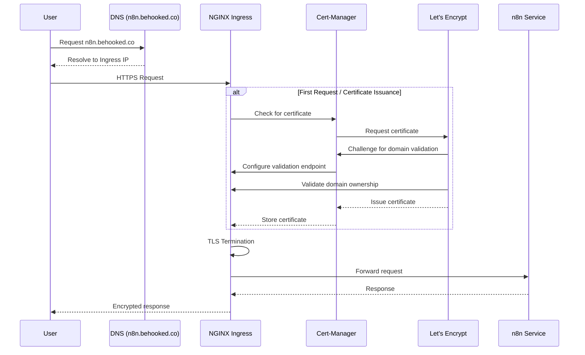
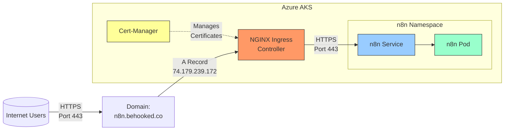

*This is Part 5 of the "Building a Production-Ready n8n Workflow Automation Platform on Azure Kubernetes Service" series. [View the complete series here](#series-link).*

# Configuring External Access and SSL/TLS

With our n8n application successfully deployed, we need to make it securely accessible from the internet. This involves:

1. Setting up an Ingress resource to route traffic to n8n
2. Implementing SSL/TLS encryption for secure communication
3. Configuring DNS for external access

Let's implement these components to complete our production deployment.

## Implementing Cert-Manager for SSL/TLS

### Why SSL/TLS is Critical

For a production workflow automation system, SSL/TLS encryption is essential because:

- It protects sensitive data transmitted between clients and n8n
- It prevents man-in-the-middle attacks
- It builds trust with users and external services
- It's required for many modern browser features
- It's a prerequisite for compliance with security standards

### Installing Cert-Manager

We used cert-manager to automate the issuance and renewal of SSL/TLS certificates from Let's Encrypt:

```bash
# Add the Jetstack Helm repository
helm repo add jetstack https://charts.jetstack.io
helm repo update

# Install cert-manager with CRDs
helm install cert-manager jetstack/cert-manager \
  --namespace cert-manager \
  --create-namespace \
  --set installCRDs=true
```

After installation, we verified cert-manager was running correctly:

```bash
kubectl get pods -n cert-manager
```

Expected output:

```
NAME                                       READY   STATUS    RESTARTS   AGE
cert-manager-xxxxxxxxx-xxxxx               1/1     Running   0          2m
cert-manager-cainjector-xxxxxxxxx-xxxxx    1/1     Running   0          2m
cert-manager-webhook-xxxxxxxxx-xxxxx       1/1     Running   0          2m
```

### Configuring a ClusterIssuer for Let's Encrypt

With cert-manager installed, we created a ClusterIssuer resource to integrate with Let's Encrypt:

```yaml
apiVersion: cert-manager.io/v1
kind: ClusterIssuer
metadata:
  name: letsencrypt-prod
spec:
  acme:
    # The ACME server URL for Let's Encrypt production
    server: https://acme-v02.api.letsencrypt.org/directory
    # Email address for Important account notifications
    email: your-email@example.com
    # Name of a secret used to store the ACME account private key
    privateKeySecretRef:
      name: letsencrypt-prod-account-key
    # Enable the HTTP-01 challenge provider
    solvers:
    - http01:
        ingress:
          class: nginx
```

This configuration:
- Uses Let's Encrypt's production ACME server
- Specifies your email for notifications about certificate expiry
- Uses the HTTP-01 challenge method for domain validation
- Associates with our nginx ingress controller

We applied this configuration:

```bash
kubectl apply -f cluster-issuer.yaml
```

## Ingress Configuration with SSL/TLS

### Setting Up DNS

Before configuring the Ingress, we created a DNS A record pointing to the external IP of our NGINX Ingress Controller:

| Record Type | Name | Value | TTL |
|-------------|------|-------|-----|
| A | n8n.behooked.co | 74.179.239.172 | 3600 |

> Note: Use your actual domain and the external IP from your NGINX Ingress Controller.

### Creating the Ingress Resource

Now we can create an Ingress resource to route external traffic to our n8n service and configure SSL/TLS:

```yaml
apiVersion: networking.k8s.io/v1
kind: Ingress
metadata:
  name: n8n-ingress
  namespace: n8n
  annotations:
    kubernetes.io/ingress.class: "nginx"
    cert-manager.io/cluster-issuer: "letsencrypt-prod"
    nginx.ingress.kubernetes.io/ssl-redirect: "true"
    nginx.ingress.kubernetes.io/proxy-body-size: "50m"
spec:
  tls:
  - hosts:
    - n8n.behooked.co
    secretName: n8n-tls-secret
  rules:
  - host: n8n.behooked.co
    http:
      paths:
      - path: /
        pathType: Prefix
        backend:
          service:
            name: n8n
            port:
              number: 5678
```

Key aspects of this configuration:
- References our ClusterIssuer to automatically obtain a certificate
- Enables SSL redirection to force HTTPS
- Increases the allowed body size for uploading files to n8n
- Routes all traffic for our domain to the n8n service
- Specifies the TLS secret where the certificate will be stored

We applied this configuration:

```bash
kubectl apply -f n8n-ingress.yaml
```

### Verifying Certificate Issuance

After applying the Ingress resource, cert-manager automatically requests a certificate from Let's Encrypt. We checked the status with:

```bash
kubectl get certificate -n n8n
```

Expected output when successful:

```
NAME             READY   SECRET           AGE
n8n-tls-secret   True    n8n-tls-secret   3m
```

If the READY status is "False", we can check for issues:

```bash
kubectl describe certificate n8n-tls-secret -n n8n
```

## External Access Flow

The following diagram illustrates how external requests flow through our system:



This process provides:
- Automatic certificate issuance and renewal
- End-to-end encryption for all external traffic
- Simplified certificate management

## External Access Architecture

The complete external access architecture can be visualized as:



## Security Considerations

Our external access implementation includes several security enhancements:

1. **Force HTTPS**: All HTTP requests are automatically redirected to HTTPS
2. **Modern TLS**: Let's Encrypt provides modern TLS certificates with strong encryption
3. **Automatic Renewal**: Certificates are renewed automatically before they expire
4. **Rate Limiting**: Can be configured on the Ingress to prevent abuse

## Validation

To validate our external access configuration, we performed several checks:

### 1. Ingress Status

```bash
kubectl get ingress -n n8n
```

Expected output:

```
NAME          CLASS    HOSTS              ADDRESS          PORTS     AGE
n8n-ingress   <none>   n8n.behooked.co    74.179.239.172   80, 443   5m
```

### 2. Certificate Status

```bash
kubectl get certificate -n n8n
```

Expected output:

```
NAME             READY   SECRET           AGE
n8n-tls-secret   True    n8n-tls-secret   5m
```

### 3. Browser Access

We accessed `https://n8n.behooked.co` in a browser to verify:
- The site loads correctly
- The connection is secure (padlock icon)
- The certificate is valid and issued by Let's Encrypt

### 4. Certificate Details

We also examined the certificate details in the browser to confirm:
- The correct domain name
- Valid issue and expiry dates
- Let's Encrypt as the Certificate Authority

## Conclusion

Our n8n deployment is now securely accessible from the internet with HTTPS encryption, thanks to our Ingress configuration and Let's Encrypt integration. Users can safely access the n8n interface and external systems can securely connect to webhooks.

In the next article, we'll implement monitoring, maintenance procedures, and optimization techniques to ensure our deployment remains healthy and efficient. [Continue to Part 6: Monitoring and Optimization](#part6-link)

## Series Navigation

- [Part 1: Introduction & Architecture](#part1-link)
- [Part 2: Setting Up the Foundation](#part2-link)
- [Part 3: Data Layer Implementation](#part3-link)
- [Part 4: Application Layer](#part4-link)
- [Part 5: External Access and Security](#part5-link)
- [Part 6: Monitoring and Optimization](#part6-link)
- [Part 7: Troubleshooting Guide](#part7-link)
- [Part 8: Conclusion and Next Steps](#part8-link)

---

What challenges have you faced when implementing SSL/TLS for your Kubernetes applications? Have you used Let's Encrypt or other certificate providers? Share your insights in the comments!

Check out the complete code for this project on [GitHub](https://github.com/devs-hooked/n8n-azure-k8s) and feel free to star the repository if it's useful to you.
