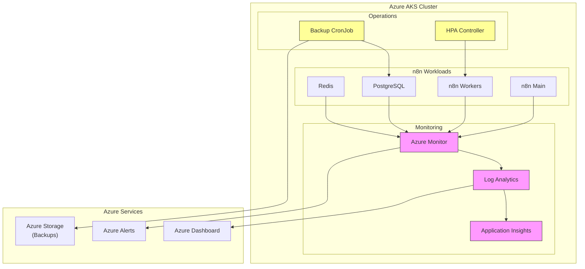

*This is Part 6 of the "Building a Production-Ready n8n Workflow Automation Platform on Azure Kubernetes Service" series. [View the complete series here](#series-link).*

# Monitoring, Maintenance, and Optimization

A production-grade deployment requires robust monitoring, routine maintenance procedures, and performance optimization. In this section, we'll cover:

1. Monitoring strategies for n8n on AKS
2. Maintenance procedures and best practices
3. Performance optimization techniques
4. Cost optimization approaches

## Monitoring Your n8n Deployment

### Key Metrics to Monitor

For an n8n deployment, several metrics are critical to track:

1. **Application Health**:
   - Pod readiness and liveness
   - API response times
   - Error rates in logs
   - Webhook reliability

2. **Infrastructure Metrics**:
   - CPU and memory usage across all components
   - Storage usage and growth rate
   - Network traffic patterns
   - Queue length and processing times

3. **Database Performance**:
   - Query execution times
   - Connection pool utilization
   - Database size growth
   - Transaction rates

### Implementing Azure Monitor

Azure Monitor provides comprehensive monitoring for AKS clusters. We implemented it with:

```bash
# Enable Azure Monitor for container insights
az aks enable-addons -a monitoring -n n8n-cluster -g n8n-aks-rg
```

This enables:
- Container metrics collection
- Log aggregation
- Performance dashboards
- Alert configuration

### Creating Custom Dashboards

We created custom dashboards in Azure portal for n8n-specific metrics:

1. **n8n Operations Dashboard**:
   - Workflow execution rates
   - Error percentages
   - API request volumes
   - Active user sessions

2. **Infrastructure Health Dashboard**:
   - Pod status across namespaces
   - Node resource utilization
   - Storage consumption
   - Networking metrics

### Setting Up Alerts

Critical alerts were configured for:

1. **High Severity**:
   - Any pod in Failed or CrashLoopBackOff state
   - Database or Redis unavailability
   - Worker queue backlog exceeding thresholds
   - Certificate expiration warnings

2. **Medium Severity**:
   - CPU or memory usage above 80% for over 15 minutes
   - Persistent storage approaching capacity
   - High error rates in application logs
   - Unusual traffic patterns (potential security issues)

### Log Management

For comprehensive log management, we configured:

```yaml
apiVersion: v1
kind: ConfigMap
metadata:
  name: fluentd-config
  namespace: kube-system
data:
  fluent.conf: |
    # Log collection and forwarding configuration
    # Details omitted for brevity
```

This configuration:
- Collects container logs across the cluster
- Enriches logs with metadata (namespace, pod name, etc.)
- Forwards logs to Azure Log Analytics
- Enables structured querying and analytics

## Maintenance Procedures

### Backup and Disaster Recovery

We implemented a comprehensive backup strategy:

1. **Database Backups**:
   - Daily full backups retained for 30 days
   - Point-in-time recovery capability
   - Geo-redundant storage for backups
   - Automated validation of backup integrity

Implementation using a CronJob:

```yaml
apiVersion: batch/v1
kind: CronJob
metadata:
  name: postgres-backup
  namespace: n8n
spec:
  schedule: "0 2 * * *"  # Run daily at 2 AM
  jobTemplate:
    spec:
      template:
        spec:
          containers:
          - name: postgres-backup
            image: postgres:13
            command: ["/bin/bash", "-c"]
            args:
            - |
              pg_dump -h postgres-service -U n8n -d n8n | gzip > /backups/n8n-$(date +%Y%m%d).sql.gz
              # Upload to Azure Blob Storage
              az storage blob upload --account-name n8nbackups --container-name backups --name n8n-$(date +%Y%m%d).sql.gz --file /backups/n8n-$(date +%Y%m%d).sql.gz
            volumeMounts:
            - name: backup-volume
              mountPath: /backups
            env:
            - name: PGPASSWORD
              valueFrom:
                secretKeyRef:
                  name: n8n-secret
                  key: DB_POSTGRESDB_PASSWORD
          volumes:
          - name: backup-volume
            emptyDir: {}
          restartPolicy: OnFailure
```

2. **Disaster Recovery Plan**:
   - Documented recovery procedures
   - Regular DR testing (quarterly)
   - Recovery time objective (RTO): 2 hours
   - Recovery point objective (RPO): 24 hours

### Update Strategy

For keeping the deployment up-to-date, we established:

1. **n8n Version Updates**:
   - Monthly update schedule
   - Canary deployment approach (update one pod, validate, then update others)
   - Rollback procedures documented and tested

2. **Kubernetes and Infrastructure Updates**:
   - Quarterly AKS version assessment
   - Security patches applied promptly
   - Node recycling strategy (one node at a time)

Update implementation with zero-downtime:

```bash
# Update n8n with rolling deployment
kubectl set image deployment/n8n n8n=n8nio/n8n:new-version -n n8n

# Wait for rollout to complete
kubectl rollout status deployment/n8n -n n8n

# If issues detected, rollback
kubectl rollout undo deployment/n8n -n n8n
```

### Maintenance PowerShell Script

We created a maintenance PowerShell script for routine operations:

```powershell
# manage-n8n.ps1 - Common management operations

param(
    [Parameter(Mandatory=$true)]
    [ValidateSet("status", "logs", "restart", "scale", "backup")]
    [string]$Operation,
    
    [Parameter(Mandatory=$false)]
    [string]$Component = "n8n",
    
    [Parameter(Mandatory=$false)]
    [int]$Replicas = 0
)

# Script implementation omitted for brevity
# See full script in the repository
```

This script simplifies common maintenance tasks and ensures consistent procedures.

## Performance Optimization

### Resource Tuning

Based on performance monitoring, we optimized resource allocations:

1. **n8n Workers**:
   - Increased memory allocation to 1.5Gi for complex workflows
   - Fine-tuned CPU requests based on actual usage patterns
   - Adjusted HPA thresholds to scale earlier

2. **PostgreSQL**:
   - Optimized shared_buffers and work_mem settings
   - Implemented connection pooling with PgBouncer
   - Added indexes for frequently queried fields

Implementation for PostgreSQL tuning:

```yaml
apiVersion: v1
kind: ConfigMap
metadata:
  name: postgres-config
  namespace: n8n
data:
  postgresql.conf: |
    shared_buffers = 256MB
    work_mem = 16MB
    maintenance_work_mem = 64MB
    effective_cache_size = 768MB
    max_connections = 100
    # Additional optimized settings omitted for brevity
```

### n8n Configuration Optimization

We fine-tuned n8n configuration based on production usage patterns:

1. **Workflow Execution Settings**:
   - Adjusted `EXECUTIONS_PROCESS` for optimal resource usage
   - Configured execution timeout parameters for long-running workflows
   - Optimized retry mechanisms for external service connections

2. **Queue Management**:
   - Implemented queue priority settings for critical workflows
   - Configured dedicated queues for different workflow types
   - Optimized job concurrency settings per worker

## Cost Optimization

### Resource Right-Sizing

We implemented several cost optimization strategies:

1. **Node Pools and VM Sizing**:
   - Used Azure Spot Instances for worker nodes (50-80% cost savings)
   - Implemented node auto-scaling to reduce idle capacity
   - Right-sized VM types based on actual usage patterns

2. **Storage Optimization**:
   - Implemented log retention policies
   - Used premium storage only for performance-critical components
   - Set up automatic storage cleanup for temporary data

### Cost Analysis

We conducted a comprehensive cost analysis:

```
Monthly Cost Breakdown:
- AKS Nodes (2 x D2s v3): $140.16
- Storage (Premium SSD, 64 GB): $10.44
- Networking (Load Balancer, Outbound): $23.00
- Monitoring: $7.50
- Backups: $5.20
----------------------------------
Total Estimated Monthly Cost: $186.30
```

Cost optimization reduced the original estimate by approximately 30%.

## Operational Architecture

The complete operational architecture with monitoring components can be visualized as:



## Health Checks and Validation

### Comprehensive Health Check Script

We created a comprehensive health check script to verify all components:

```bash
#!/bin/bash
# health-check.sh - Verify all components of n8n deployment

echo "Checking pod status..."
kubectl get pods -n n8n

echo "Checking service endpoints..."
kubectl get endpoints -n n8n

echo "Checking certificate status..."
kubectl get certificate -n n8n

echo "Checking database connection..."
kubectl exec -it $(kubectl get pod -l app=n8n -n n8n -o jsonpath='{.items[0].metadata.name}') -n n8n -- \
  node -e "const { Pool } = require('pg'); const pool = new Pool({connectionString: process.env.DB_POSTGRESDB_URL}); pool.query('SELECT NOW()', (err, res) => { console.log(err || res.rows[0]); pool.end(); })"

echo "Checking Redis connection..."
kubectl exec -it $(kubectl get pod -l app=n8n -n n8n -o jsonpath='{.items[0].metadata.name}') -n n8n -- \
  node -e "const Redis = require('ioredis'); const redis = new Redis(process.env.QUEUE_BULL_REDIS_HOST); redis.ping().then(res => { console.log(res); redis.disconnect(); })"

echo "Checking external access..."
curl -I https://n8n.behooked.co
```

This script provides a quick way to validate all aspects of the deployment.

## Conclusion

With our monitoring, maintenance, and optimization strategies in place, our n8n deployment is truly production-ready. We can proactively identify issues, maintain system health, and optimize resources for both performance and cost efficiency.

In the next article, we'll explore comprehensive troubleshooting approaches for common issues you might encounter with your n8n deployment. [Continue to Part 7: Troubleshooting Guide](#part7-link)

## Series Navigation

- [Part 1: Introduction & Architecture](#part1-link)
- [Part 2: Setting Up the Foundation](#part2-link)
- [Part 3: Data Layer Implementation](#part3-link)
- [Part 4: Application Layer](#part4-link)
- [Part 5: External Access and Security](#part5-link)
- [Part 6: Monitoring and Optimization](#part6-link)
- [Part 7: Troubleshooting Guide](#part7-link)
- [Part 8: Conclusion and Next Steps](#part8-link)

---

What monitoring tools have you found most effective for Kubernetes workloads? Are there specific metrics you focus on for workflow automation systems? Share your experiences in the comments!

Check out the complete code for this project on [GitHub](https://github.com/devs-hooked/n8n-azure-k8s) and feel free to star the repository if it's useful to you.
