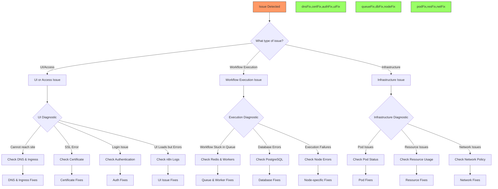

*This is Part 7 of the "Building a Production-Ready n8n Workflow Automation Platform on Azure Kubernetes Service" series. [View the complete series here](#series-link).*

# Troubleshooting and Problem Resolution

Welcome to Part 7 of our n8n on AKS series! In [Part 6](#part6-link), we implemented monitoring and optimization strategies. Even with the best preparation, issues can arise, so today we'll explore comprehensive troubleshooting techniques.

Even the most carefully designed systems encounter issues. This section provides a comprehensive guide to troubleshooting common problems you might encounter with your n8n deployment on AKS.

## Common Issues and Resolutions

### Database Connection Issues

**Symptoms:**
- n8n pods showing errors like `Error: connect ETIMEDOUT` or `Error: connect ECONNREFUSED`
- Database-related error messages in n8n logs
- n8n UI showing database connection errors

**Diagnostic Approach:**

1. Check PostgreSQL pod status:
   ```bash
   kubectl get pods -n n8n -l app=postgres
   ```

2. Verify PostgreSQL service:
   ```bash
   kubectl get svc postgres-service -n n8n
   ```

3. Check database logs:
   ```bash
   kubectl logs $(kubectl get pod -l app=postgres -n n8n -o jsonpath='{.items[0].metadata.name}') -n n8n
   ```

4. Test database connection from n8n pod:
   ```bash
   kubectl exec -it $(kubectl get pod -l app=n8n -n n8n -o jsonpath='{.items[0].metadata.name}') -n n8n -- \
     node -e "const { Pool } = require('pg'); const pool = new Pool({host: 'postgres-service', user: process.env.DB_POSTGRESDB_USER, password: process.env.DB_POSTGRESDB_PASSWORD, database: 'n8n'}); pool.query('SELECT NOW()', (err, res) => { console.log(err || res.rows[0]); pool.end(); })"
   ```

**Common Resolutions:**

1. **Authentication Issues**:
   - Verify the PostgreSQL credentials in the Kubernetes secrets
   - Ensure the n8n database user exists and has proper permissions

2. **Network Issues**:
   - Check if pods are in the same namespace
   - Verify that the service name resolution works
   - Ensure no network policies are blocking the connection

3. **Database Health Issues**:
   - Check for PostgreSQL resource constraints
   - Verify the database isn't in recovery mode
   - Check for disk space issues

### Queue/Redis Connection Issues

**Symptoms:**
- Workflows are triggered but stay in "waiting" status
- Error messages like `Error connecting to Redis` in n8n logs
- Workers not processing queued workflows

**Diagnostic Approach:**

1. Check Redis pod status:
   ```bash
   kubectl get pods -n n8n -l app=redis
   ```

2. Verify Redis service:
   ```bash
   kubectl get svc redis-service -n n8n
   ```

3. Check Redis logs:
   ```bash
   kubectl logs $(kubectl get pod -l app=redis -n n8n -o jsonpath='{.items[0].metadata.name}') -n n8n
   ```

4. Test Redis connection from n8n pod:
   ```bash
   kubectl exec -it $(kubectl get pod -l app=n8n -n n8n -o jsonpath='{.items[0].metadata.name}') -n n8n -- \
     node -e "const Redis = require('ioredis'); const redis = new Redis('redis-service'); redis.ping().then(res => { console.log(res); redis.disconnect(); })"
   ```

**Common Resolutions:**

1. **Connection Configuration**:
   - Verify Redis host and port settings in n8n environment variables
   - Check if the Redis service name is correctly specified

2. **Queue Stuck Issues**:
   - Clear stuck queues with Redis CLI commands
   - Restart the Redis pod if necessary

3. **Worker Configuration**:
   - Ensure workers are configured for queue mode
   - Verify workers have the same encryption key as the main n8n instance

### SSL/TLS Certificate Issues

**Symptoms:**
- Browser shows "Your connection is not private" warning
- Certificate errors in browser console
- Ingress controller logs showing certificate issues

**Diagnostic Approach:**

1. Check certificate status:
   ```bash
   kubectl get certificate -n n8n
   ```

2. Examine certificate details:
   ```bash
   kubectl describe certificate n8n-tls-secret -n n8n
   ```

3. Check cert-manager logs:
   ```bash
   kubectl logs -n cert-manager -l app=cert-manager
   ```

4. Verify the ClusterIssuer status:
   ```bash
   kubectl describe clusterissuer letsencrypt-prod
   ```

**Common Resolutions:**

1. **Domain Validation Issues**:
   - Ensure DNS is correctly configured to point to your ingress controller IP
   - Verify that the HTTP-01 challenge can reach your ingress controller
   - Check if Let's Encrypt rate limits have been hit (5 certificates per domain per week)

2. **Configuration Issues**:
   - Verify email address in ClusterIssuer is valid
   - Ensure ingress class is correctly specified
   - Check TLS section in Ingress resource matches your domain

3. **Certificate Renewal Issues**:
   - Manually trigger certificate renewal if needed
   - Check if cert-manager CRDs are up to date
   - Verify cert-manager has necessary permissions

### Ingress and External Access Issues

**Symptoms:**
- Unable to access n8n UI from the internet
- 404, 502, or other HTTP errors when accessing your domain
- Timeouts when attempting to connect

**Diagnostic Approach:**

1. Check Ingress resource status:
   ```bash
   kubectl get ingress -n n8n
   ```

2. Verify Ingress controller pods:
   ```bash
   kubectl get pods -n default -l app.kubernetes.io/name=ingress-nginx
   ```

3. Check Ingress controller logs:
   ```bash
   kubectl logs -n default -l app.kubernetes.io/name=ingress-nginx
   ```

4. Test connectivity to Ingress IP:
   ```bash
   curl -v http://<ingress-ip>
   ```

**Common Resolutions:**

1. **DNS Issues**:
   - Verify DNS A record points to the correct Ingress Controller IP
   - Check if DNS propagation is complete (may take up to 48 hours)
   - Use `nslookup` or `dig` to verify DNS resolution

2. **Ingress Configuration**:
   - Ensure the Ingress resource specifies the correct service and port
   - Verify host rules match your domain exactly
   - Check path settings and ensure they match n8n requirements

3. **Network Issues**:
   - Verify Azure Network Security Groups allow traffic on ports 80 and 443
   - Check if any firewalls are blocking access to your AKS cluster
   - Ensure the Ingress Controller service is of type LoadBalancer with an external IP

## Troubleshooting Decision Tree

The following diagram presents a structured approach to troubleshooting n8n deployment issues:



## Advanced Diagnostic Workflows

### Database Performance Issues

If workflow execution is slow or database operations are taking too long:

1. Check database load:
   ```bash
   kubectl exec -it $(kubectl get pod -l app=postgres -n n8n -o jsonpath='{.items[0].metadata.name}') -n n8n -- \
     psql -U postgres -c "SELECT * FROM pg_stat_activity WHERE state = 'active';"
   ```

2. Identify long-running queries:
   ```bash
   kubectl exec -it $(kubectl get pod -l app=postgres -n n8n -o jsonpath='{.items[0].metadata.name}') -n n8n -- \
     psql -U postgres -c "SELECT pid, now() - query_start AS duration, query FROM pg_stat_activity WHERE state = 'active' ORDER BY duration DESC;"
   ```

3. Check table sizes and index usage:
   ```bash
   kubectl exec -it $(kubectl get pod -l app=postgres -n n8n -o jsonpath='{.items[0].metadata.name}') -n n8n -- \
     psql -U postgres -d n8n -c "SELECT relname, pg_size_pretty(pg_total_relation_size(relid)) AS total_size FROM pg_catalog.pg_statio_user_tables ORDER BY pg_total_relation_size(relid) DESC;"
   ```

### Memory Leak Investigation

If n8n pods are steadily increasing in memory usage:

1. Get memory usage metrics:
   ```bash
   kubectl top pods -n n8n
   ```

2. Check container memory limit and usage:
   ```bash
   kubectl describe pod $(kubectl get pod -l app=n8n -n n8n -o jsonpath='{.items[0].metadata.name}') -n n8n
   ```

3. Generate a heap dump (for advanced debugging):
   ```bash
   kubectl exec -it $(kubectl get pod -l app=n8n -n n8n -o jsonpath='{.items[0].metadata.name}') -n n8n -- \
     node --expose-gc -e "const fs=require('fs'); setTimeout(() => { global.gc(); const heapSnapshot = require('v8').getHeapSnapshot(); const file = fs.createWriteStream('/tmp/heap.json'); heapSnapshot.pipe(file); }, 1000);"
   
   kubectl cp n8n/$(kubectl get pod -l app=n8n -n n8n -o jsonpath='{.items[0].metadata.name}'):/tmp/heap.json ./heap.json
   ```

4. Analyze the heap dump with Chrome DevTools or a memory analyzer.

### Network Connectivity Issues

If services can't communicate with each other:

1. Test network connectivity between pods:
   ```bash
   kubectl exec -it $(kubectl get pod -l app=n8n -n n8n -o jsonpath='{.items[0].metadata.name}') -n n8n -- \
     nc -zv postgres-service 5432
   
   kubectl exec -it $(kubectl get pod -l app=n8n -n n8n -o jsonpath='{.items[0].metadata.name}') -n n8n -- \
     nc -zv redis-service 6379
   ```

2. Check if network policies are restricting traffic:
   ```bash
   kubectl get networkpolicies -n n8n
   ```

3. Verify DNS resolution:
   ```bash
   kubectl exec -it $(kubectl get pod -l app=n8n -n n8n -o jsonpath='{.items[0].metadata.name}') -n n8n -- \
     nslookup postgres-service
   
   kubectl exec -it $(kubectl get pod -l app=n8n -n n8n -o jsonpath='{.items[0].metadata.name}') -n n8n -- \
     nslookup redis-service
   ```

## Creating a Diagnostic Information Bundle

For complex issues, it's often helpful to collect comprehensive diagnostic information:

```bash
#!/bin/bash
# collect-diagnostics.sh - Collect diagnostic information for n8n deployment

# Create output directory
mkdir -p n8n-diagnostics
cd n8n-diagnostics

# Collect pod information
kubectl get pods -n n8n -o yaml > pods.yaml
kubectl describe pods -n n8n > pods-describe.txt

# Collect logs
for pod in $(kubectl get pods -n n8n -o jsonpath='{.items[*].metadata.name}'); do
  kubectl logs $pod -n n8n > $pod-logs.txt
done

# Collect service and endpoint information
kubectl get svc,endpoints -n n8n -o yaml > services.yaml

# Collect ingress and certificate information
kubectl get ingress,certificate -n n8n -o yaml > ingress-cert.yaml
kubectl describe ingress,certificate -n n8n > ingress-cert-describe.txt

# Collect events
kubectl get events -n n8n > events.txt

# Collect resource usage
kubectl top pods -n n8n > pod-resources.txt
kubectl top nodes > node-resources.txt

# Create a tar archive
tar -czf n8n-diagnostics.tar.gz *

echo "Diagnostic information collected in n8n-diagnostics.tar.gz"
```

## Troubleshooting Cheatsheet

| Issue | Check Command | Resolution Strategy |
|-------|--------------|---------------------|
| Pod won't start | `kubectl describe pod <pod-name> -n n8n` | Check events section for errors |
| Pod crashing | `kubectl logs <pod-name> -n n8n` | Look for error messages near the end |
| Service unavailable | `kubectl get endpoints <service-name> -n n8n` | Verify endpoints exist |
| Certificate issues | `kubectl describe certificate <cert-name> -n n8n` | Check events and conditions |
| Database connection | `kubectl exec -it <n8n-pod> -n n8n -- env \| grep DB_` | Verify environment variables |
| Redis connection | `kubectl exec -it <n8n-pod> -n n8n -- env \| grep REDIS` | Verify environment variables |
| Ingress not working | `kubectl get ingress <ingress-name> -n n8n` | Check ADDRESS field has an IP |
| Resource constraints | `kubectl top pods -n n8n` | Check for pods near resource limits |
| Webhook not triggering | `kubectl logs <n8n-pod> -n n8n \| grep webhook` | Verify webhook URL and connectivity |

## Summary

Troubleshooting a production n8n deployment on AKS requires a systematic approach. By understanding:

1. **Common failure modes** and their symptoms
2. **Diagnostic approaches** for each component
3. **Resolution strategies** for different issues

You can quickly identify and resolve problems, minimizing downtime and ensuring a reliable workflow automation platform.

Remember that many issues can be prevented through proper monitoring and proactive maintenance, as discussed in the previous section. When problems do occur, having these troubleshooting procedures documented will significantly reduce the mean time to resolution.

## Conclusion

Armed with these troubleshooting strategies and diagnostic workflows, you can quickly identify and resolve issues in your n8n deployment. Remember that systematic investigation and a good understanding of the architecture are key to efficient problem resolution.

In our final article, we'll summarize what we've accomplished, review the benefits of our architecture, and explore advanced enhancements for the future. [Continue to Part 8: Conclusion and Next Steps](#part8-link)

## Series Navigation

- [Part 1: Introduction & Architecture](#part1-link)
- [Part 2: Setting Up the Foundation](#part2-link)
- [Part 3: Data Layer Implementation](#part3-link)
- [Part 4: Application Layer](#part4-link)
- [Part 5: External Access and Security](#part5-link)
- [Part 6: Monitoring and Optimization](#part6-link)
- [Part 7: Troubleshooting Guide](#part7-link)
- [Part 8: Conclusion and Next Steps](#part8-link)

---

What troubleshooting techniques have you found most effective for Kubernetes applications? Have you encountered any particularly challenging issues with workflow automation systems? Share your stories in the comments!

Check out the complete code for this project on [GitHub](https://github.com/devs-hooked/n8n-azure-k8s) and feel free to star the repository if it's useful to you.
